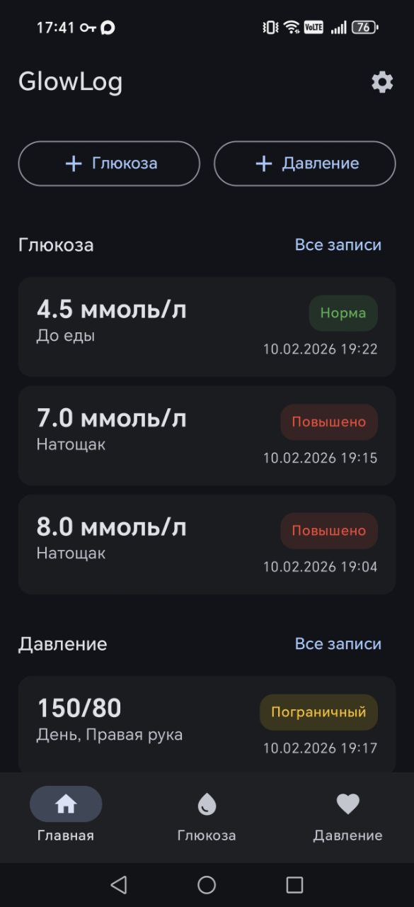
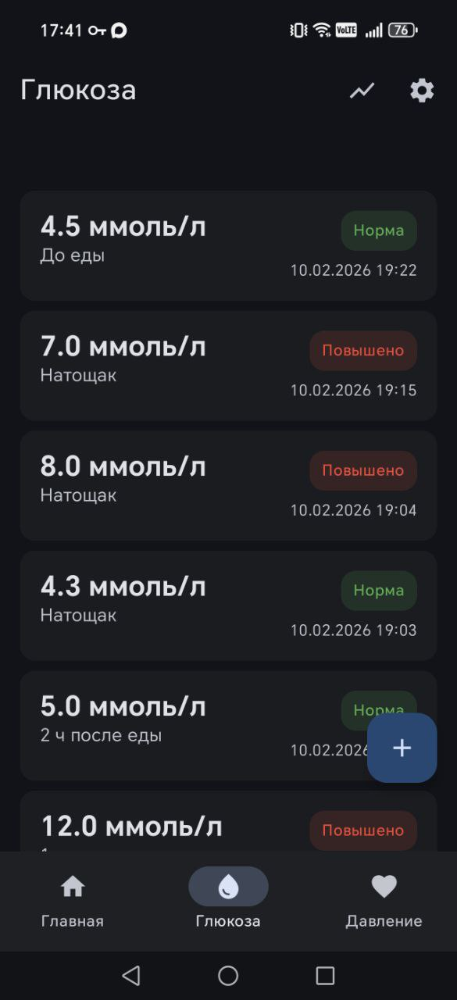
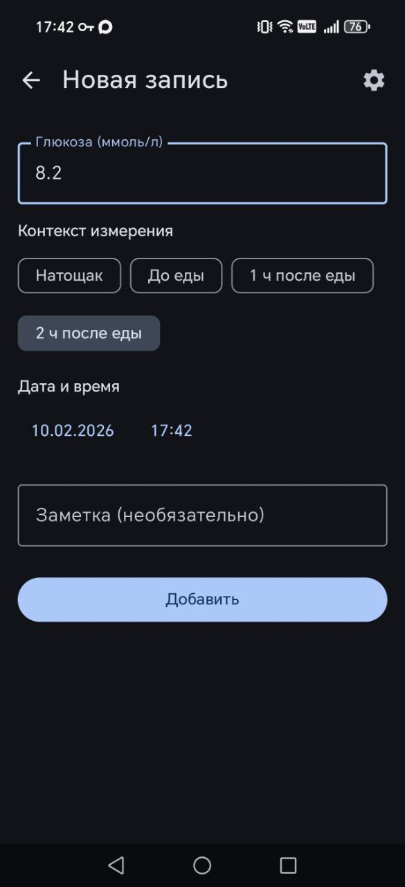
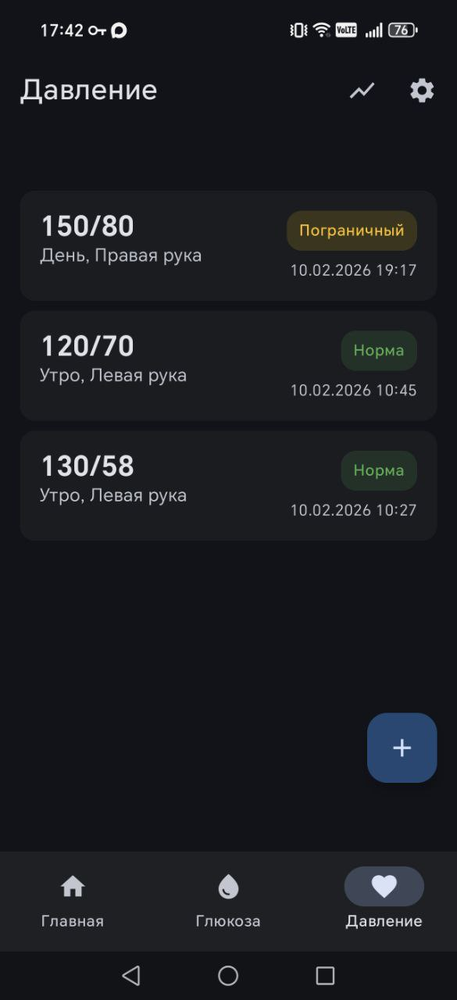
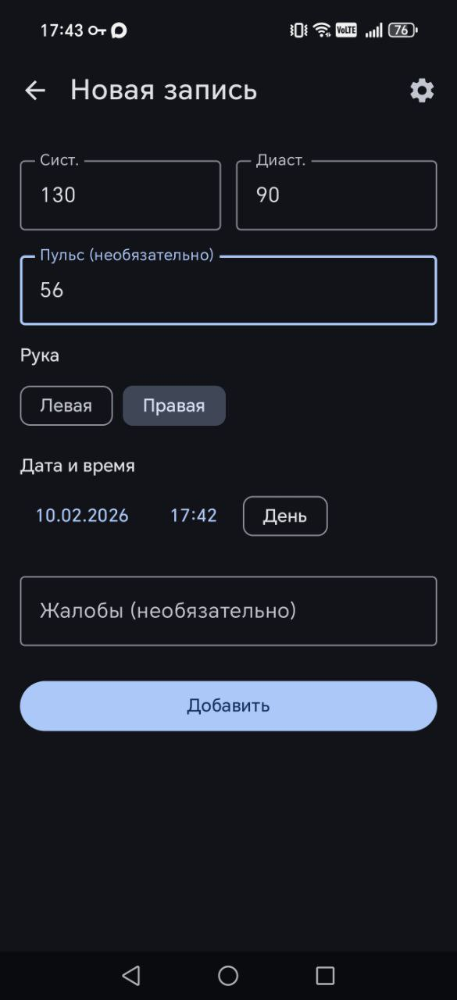

# GlowLog

**[English version](README.md)**

Дневник для беременных: отслеживание глюкозы в крови и артериального давления. Offline-first Android-приложение с облачной синхронизацией через Firebase.

## Возможности

- Запись уровня глюкозы с контекстом (натощак, до еды, 1ч/2ч после еды)
- Запись артериального давления с выбором руки (левая/правая) и автоопределением времени суток
- Цветовая индикация статуса по пороговым значениям гестационного диабета
- Интерактивные графики (неделя/месяц)
- Вход через Google с облачной синхронизацией через Firestore
- Настраиваемые напоминания через точные алармы
- CSV-экспорт в формате медицинского дневника
- Полная работа офлайн — Room является единственным источником правды

## Скриншоты

<p align="center">
  
  
  
  
  
</p>

## Стек технологий

| Компонент | Технология |
|---|---|
| Язык | Kotlin |
| UI | Jetpack Compose + Material 3 |
| Локальная БД | Room |
| Облако | Firebase Firestore (offline-first) |
| Авторизация | Firebase Auth (Google Sign-In) |
| DI | Hilt |
| Графики | Vico (Compose-native) |
| Навигация | Navigation Compose |
| Напоминания | AlarmManager + BroadcastReceiver |
| Фоновая синхронизация | WorkManager |
| Настройки | DataStore |
| Min SDK | 26 (Android 8.0) |
| Target SDK | 35 |

## Сборка

Требуется JDK 17 и Android SDK 35.

```bash
JAVA_HOME=~/.jdks/temurin-17.0.7 ./gradlew assembleDebug
```

Путь к Android SDK задан в `local.properties`.

## Архитектура

- **Single Activity** с Jetpack Compose
- **MVVM**: Screen → ViewModel → Repository → DAO / Firestore
- **Offline-first**: Room — единственный источник правды. UI читает через Flow. Записи сохраняются локально (`isSynced=false`), затем SyncWorker загружает в Firestore
- **Soft delete**: `isDeleted=true` вместо физического удаления, для корректной синхронизации
- **Конфликты**: last-write-wins по `updatedAt`

## Структура проекта

```
com.glowlog.app/
├── GlowLogApplication.kt             — @HiltAndroidApp
├── MainActivity.kt                    — Single Activity, Compose host
├── data/
│   ├── local/
│   │   ├── db/                        — Room: GlowLogDatabase, Converters
│   │   │   ├── dao/                   — GlucoseReadingDao, BloodPressureReadingDao
│   │   │   └── entity/               — GlucoseReadingEntity, BloodPressureReadingEntity
│   │   └── datastore/                — UserPreferences (DataStore)
│   ├── remote/
│   │   ├── firestore/                — FirestoreGlucoseSource, FirestoreBloodPressureSource, DTO
│   │   └── auth/                     — FirebaseAuthManager
│   ├── repository/                   — Интерфейсы + реализации (Glucose, BloodPressure, Auth, Sync)
│   ├── sync/                         — SyncManager, SyncWorker (WorkManager)
│   └── export/                       — CsvExporter
├── domain/model/                     — GlucoseReading, BloodPressureReading, MealContext, ReadingStatus и др.
├── ui/
│   ├── navigation/                   — GlowLogNavHost, Screen (sealed class), BottomNavBar
│   ├── theme/                        — Color, Type, Theme (динамические цвета)
│   ├── common/                       — Общие компоненты и утилиты
│   ├── home/                         — Дашборд
│   ├── glucose/{list,add,chart}/     — Экраны глюкозы + ViewModels
│   ├── bloodpressure/{list,add,chart}/ — Экраны давления + ViewModels
│   ├── settings/                     — SettingsScreen + SettingsViewModel
│   └── auth/                         — SignInScreen + SignInViewModel
├── reminder/                         — ReminderScheduler, ReminderReceiver, BootReceiver
└── di/                               — AppModule, RepositoryModule, SyncModule
```

## Пороговые значения (гестационный диабет)

Логика в `ReadingStatusUtil.kt`:

| Контекст | Норма | Погранично | Повышено |
|---|---|---|---|
| Натощак / до еды | ≤ 5.1 | 5.1–5.6 | > 5.6 |
| 1 ч после еды | ≤ 10.0 | 10.0–11.0 | > 11.0 |
| 2 ч после еды | ≤ 8.5 | 8.5–9.3 | > 9.3 |
| Давление (сист/диаст) | < 140/90 | 140–150 / 90–95 | > 150/95 |

Статусы: NORMAL (зелёный), BORDERLINE (жёлтый), HIGH (красный).

## Синхронизация

Коллекции Firestore: `users/{userId}/glucose_readings/{id}`, `users/{userId}/blood_pressure_readings/{id}`.

Триггеры: после каждой записи, при выходе на передний план, после входа в аккаунт, каждые 6 часов (периодически), вручную из настроек.

## CSV-экспорт

Глюкоза:
```
Дата,Время,Глюкоза (ммоль/л),Контекст,Статус,Заметка
```

Давление (сводная таблица по дате):
```
Дата,Утро АД правая,Утро АД левая,День АД правая,День АД левая,Вечер АД правая,Вечер АД левая,Ночь АД правая,Ночь АД левая,Пульс,Жалобы
```

## Настройка Firebase

1. Создайте проект в Firebase
2. Добавьте Android-приложение с package name `com.glowlog.app`
3. Скачайте `google-services.json` и поместите в `app/`
4. Включите Authentication (провайдер Google) и Firestore в консоли Firebase
5. Добавьте SHA-1 отпечаток вашего приложения в настройках проекта Firebase

## Лицензия

Лицензия [Apache License, Version 2.0](LICENSE).

Информация об авторстве — в файле [NOTICE](NOTICE).
